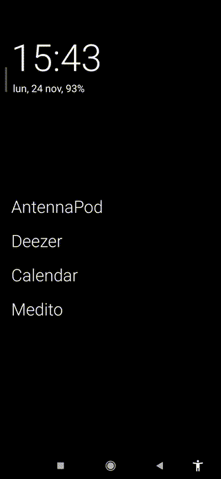

# UniPrimera Respuesta

***

**Aplicación móvil interdisciplinaria para la gestión rápida y eficiente de emergencias en campus universitario**

## Descripción general del proyecto

UniPrimera Respuesta es una iniciativa desarrollada por un equipo interdisciplinario para enfrentar la reacción tardía ante emergencias en campus universitarios. El proyecto responde a la necesidad institucional de articular un llamado de auxilio rápido y eficiente sin recurrir al teléfono, permitiendo la asistencia de emergencias mediante una app móvil y un botón físico. La solución integra rutas de acción definidas, activación de alertas inmediatas y coordinación con el Centro de Prevención y Respuesta a Emergencias (CEPRAE) de la universidad. Gracias al uso de tecnología móvil y nodos físicos, se busca fortalecer la cultura de prevención, aumentar la resiliencia institucional y posicionar a la universidad como actor activo en la gestión de riesgo y atención temprana de emergencias.

## Problema que resuelve

En los campus universitarios, la atención de emergencias suele enfrentar retrasos significativos debido a la desarticulación de canales de alerta. El sistema tradicional demanda el uso de teléfono y procedimientos manuales que resultan poco ágiles ante situaciones de riesgo, poniendo en peligro la integridad de los estudiantes, docentes y personal administrativo. **UniPrimera Respuesta** soluciona este problema mediante un sistema automatizado que reduce el tiempo de reacción desde la ocurrencia de la emergencia hasta la activación del protocolo de atención institucional, centralizando la alerta y facilitando la comunicación directa y efectiva entre los usuarios y los responsables de atención primaria.

## Justificación del valor aportado

- **Mejora la rapidez y calidad en la atención de situaciones críticas.**
- Facilita la inclusión de toda la comunidad universitaria como potenciales primeros respondedores.
- Promueve una cultura organizacional proactiva y resiliente.
- Implementa tecnología accesible y escalable.
- Reduce el riesgo de omisión o demoras por desinformación o falta de acceso

## Relación con las necesidades del usuario/cliente

El producto responde directamente a los requerimientos expresados por usuarios (estudiantes, docentes, administrativos) y responsables institucionales en cuanto a seguridad y respuesta ante emergencias. La solución privilegia la usabilidad, rapidez, privacidad y accesibilidad, integrando procesos que facilitan el reporte de incidencias y la activación de rutas de atención.
## Objetivos del proyecto

### Objetivo general
Desarrollar una solución tecnológica integrada (app móvil y botón físico) que articule la reacción ante emergencias en campus universitario, facilitando el llamado rápido y la coordinación con entidades responsables de atención.

### Objetivos específicos
- Implementar una app móvil con flujos optimizados para reportar incidencias en tres clics o menos.
- Diseñar e instalar prototipos funcionales de botones físicos ubicados en puntos estratégicos del campus.
- Integrar la identificación y geolocalización automática de usuarios al reporte de emergencia.
- Establecer protocolos ágiles de comunicación y validación con el CEPRAE.
- Probar el sistema en simulacros reales y recoger feedback para validación y mejora continua.

## Tecnologías utilizadas

| Componentes     | Tecnología                 | Detalle                                                      |
|:--------------- |:------------------------- |:------------------------------------------------------------ |
| Frontend        | Flutter (Dart)            | Framework multiplataforma, interfaz móvil                    |
| Backend         | Node.js, Express          | API RESTful, manejo de envío email                           |
| Email           | Nodemailer                | Configuración SMTP (Gmail) para notificaciones               |
| Infraestructura | Localtunnel               | Exposición de servidor local para pruebas externas           |
| Librerías       | http, geolocator, shared_preferences, device_info_plus, url_launcher |
| Base de datos   | No implementada           | (Se prevé integración futura)                                |

## Arquitectura del sistema

El sistema está compuesto por los siguientes módulos:

```ascii
+---------------------------+
|   App Flutter (Frontend)  |
+-----+-------------+-------+
      |             |
      v             v
+----------+  +--------------+
| Nodo Físico|  |Servidor Node|
+----------+  +--------------+
      |         |
+---------------------------+
|CEPRAE / Notificaciones    |
+---------------------------+
```

**Flujo de datos:**

1. El usuario inicia sesión e ingresa datos personales.
2. Selecciona el tipo de emergencia y responde el cuestionario.
3. La app envía un JSON al backend mediante HTTP POST.
4. El backend procesa el reporte y envía una notificación por email.
5. Se activa una llamada automática al protocolo de extensión CEPRAE.
6. El usuario recibe confirmación y opción de volver al inicio.

## Demonstración



## Instalación y configuración en entorno local

### Requisitos previos
- Flutter versión >=3.9.2
- Node.js
- Git
- Terminal/Shell con permisos de administrador
- Acceso a internet para descargar dependencias y exponer servidor

### Dependencias principales
- Flutter: `http`, `shared_preferences`, `geolocator`, `device_info_plus`, `url_launcher`
- Node.js: `express`, `nodemailer`, `body-parser`
- Localtunnel

### Instalación paso a paso

#### 1. Clona el repositorio
```bash
git clone https://github.com/TuUsuario/UniPrimera_Respuesta.git
cd UniPrimera_Respuesta
flutter pub get # Instala dependencias
```

#### 2. Configura el servidor backend
```bash
cd servidor/
npm install express nodemailer body-parser
node server.js
```
Asegúrate que el servidor escuche en `0.0.0.0:3000`.

#### 3. Exponer el servidor con Localtunnel
```bash
npm install -g localtunnel
lt --port 3000 --subdomain uniprimer
```
Configura la URL en el código Flutter según el subdominio generado.

#### 4. Configura variables de entorno
- Edita `server.js` con tu correo y credenciales SMTP reales para el envío.
- En la app, cambia la URL de envío (`LOCALTUNNEL_URL` y/o `EMULATOR_FALLBACK_URL`) si usas tu propio túnel.

#### 5. Ejecución y pruebas
- Ejecuta la app en emulador o dispositivo real:
```bash
flutter run
```
- Instala el APK en Android o ejecuta desde USB/cable.
- Lanza servidor y túnel antes de enviar reportes.

### Solución a errores comunes
- Verifica conectividad internet y estado activo de Localtunnel.
- Revisa credenciales SMTP, puertos y permisos del firewall.
- Si el envío falla, valida que la URL en código coincida con la de Localtunnel.

## Guía de uso de la aplicación

1. Abrir la aplicación y completar el registro (nombre, apellido, documento).
2. Aceptar condiciones de uso y permisos de localización.
3. Pulsar el botón de emergencia principal.
4. Seleccionar el tipo de emergencia.
5. Completar el cuestionario interactivo.
6. Enviar el reporte: se activa email y llamada automática a la extensión institucional.
7. Visualizar la pantalla de confirmación y volver al inicio.

**Ejemplo de interacción:**  
Usuario identifica accidente químico, pulsa botón, selecciona \"Químico\", describe la situación y envía el reporte.  
La app demuestra mensaje \"¡Alerta enviada con éxito!\" y activa extensión 88888.

## Explicación de la interfaz y/o endpoints

- **Pantalla de inicio:** Ingreso de datos personales, acepta términos y permisos.
- **Botón de emergencia:** Lleva a la selección del tipo de incidente.
- **Selección de emergencia y cuestionario:** Interactivo y adaptativo según la situación.
- **Envío de reporte:** POST HTTP hacia el servidor, con datos estructurados en JSON.

## Metodología de desarrollo utilizada

El desarrollo fue guiado por la metodología **Design Thinking**, abordando cinco fases:
1. *Empatizar* con usuarios y expertos para identificar riesgos.
2. *Definir* el problema central de desarticulación ante emergencias.
3. *Idear* alternativas innovadoras de respuesta y reporte.
4. *Prototipar* simulacros, app y esquema físico para validación rápida.
5. *Testear* funcionalidades con actores clave y diseñar iteraciones según feedback.

## Desarrollo por etapas de UniPrimera Respuesta

### Fase 1: Corrección inicial del código
Se recibió el código base en Dart para la app Flutter, incluyendo páginas como `anonimo_page.dart`, `button_countdown.dart`, y `emergency_choice_page.dart`. Se realizó un análisis profundo para corregir errores, eliminar código innecesario (como funciones no usadas y páginas duplicadas), corregir la navegación para que la app fuera más intuitiva (utilizando `Navigator.pop` para regresar en lugar de reiniciar pantallas), y limpiar imports redundantes. Se planteó una simplificación del botón de emergencia, eliminando la cuenta regresiva para lograr una respuesta inmediata. Además, se estableció la obligatoriedad de permisos de localización GPS y un cuestionario con preguntas claves en lógica sí/no para optimizar la recopilación de información en emergencias.

### Fase 2: Añadido de funcionalidades y navegación optimizada
Se implementaron cambios solicitados para mejorar la experiencia de usuario, entre ellos:
- Remodelación de la pantalla principal para capturar nombre, apellido y documento de identidad con almacenamiento local usando `shared_preferences` para evitar la repetición.
- Eliminación del contador en el botón de emergencia para permitir activación rápida.
- Diseño de un cuestionario vital e interactivo con lógica condicional para saltar preguntas según las respuestas y limitar descripciones a 100 palabras.
- Creación de una construcción automática del reporte en formato JSON, incluyendo respuestas de usuario y geolocalización.
- Adición de una pantalla de confirmación con resumen y un botón para volver al inicio.
- Integración completa del idioma español en la interfaz para mejor usabilidad.
- Bloqueo del envío del reporte si el usuario no concede los permisos de ubicación.

### Fase 3: Depuración de errores y configuraciones
Se abordaron varios problemas técnicos:
- Corrección de la llamada a número telefónico con el modo `LaunchMode.externalApplication` para evitar errores de compatibilidad.
- Renombramiento de archivos y ajuste en la estructura para evitar errores de compilación (`anonimo_page.dart` a `emergency_button_page.dart`).
- Correcciones en importaciones, adicionando paquetes necesarios como `flutter/services.dart` para el funcionamiento correcto de `SystemNavigator`.
- Mejoras en la gestión de errores en el envío del reporte, añadiendo logs detallados para detectar timeouts o problemas de conexión.
- Centralización de configuraciones en un archivo `config.dart` para facilitar actualizaciones de URL y direcciones IP sin recompilar la app.

### Fase 4: Configuración del servidor y uso de túneles
Se trabajó en la explotación operativa del backend:
- Se enfrentaron problemas de IP dinámica y firewall, con instrucciones para abrir el puerto 3000 con UFW.
- Se recomendó el uso de servicios de túneles como Ngrok o Localtunnel para exponer el servidor local a internet con URL fija y estable.
- Se corrigieron las instrucciones de instalación y ejecución de los túneles, así como la integración en el código para detectar si la app corre en emulador o dispositivo real, adaptando la URL de servidor correspondientemente.
- Se añadieron soluciones específicas para modelos Xiaomi, relacionados con permisos especiales y optimización de batería para evitar bloqueos.

### Fase 5: Documentación y finalización
Finalmente, se elaboró un informe detallado para documentar el proyecto:
- Se redactó un README profesional, que incluyó presentación del proyecto, funcionalidades implementadas, instrucciones detalladas de instalación, uso y despliegue, así como roadmap para mejoras futuras.
- Se corrigieron omisiones, añadiendo información sobre APK disponible en el repositorio, configuración del servidor y guía concreta para el uso del subdominio en Localtunnel.
- Se propusieron instrucciones para pruebas tanto en emulador como en dispositivo real.
- Se planeó integraciones futuras y mejoras basadas en feedback y escalabilidad.

## Evidencias de validación con usuarios, expertos o actores relevantes

El proceso incluyó entrevistas con miembros de la comunidad, simulacros internos y consulta con responsables de CEPRAE. El feedback recogido respaldó el valor del sistema propuesto.  

## Relación explícita con los criterios del jurado

- Solución al problema real de emergencia en campus universitario.
- Desarrollo de prototipo funcional validado con actores relevantes.
- Avance significativo en construcción, materiales y despliegue de sistema.
- Aplicación interdisciplinaria (ingeniería civil, mecatrónica, eléctrica, ciencias sociales).
- Trabajo colaborativo integrando aportes de todos los miembros.

## Roadmap / Mejoras futuras

- Integrar APIs públicas de servicios de emergencia.
- Notificaciones push y perfiles de usuario.
- Adjuntar multimedia y análisis IA.
- Expansión a iOS, web.
- Dashboard de estadísticas (como Power BI).
- Mejoras de accesibilidad y seguridad avanzada.

## Autores, roles y contribuciones individuales

| Nombre                             | Correo                   | Carrera                             |
| ----------------------------------- | ------------------------ | ----------------------------------- |
| Patricia Perez Gabil Roso           | pperezgar@unal.edu.co       | Ingeniería civil                    |
| María Fernanda Aguasaco Arévalo     | maguasacoa@unal.edu.co   | Antropología                        |
| Héctor Andrés Aponte Porras         | haponte@unal.edu.co      | Ingeniería Mecatrónica              |
| Daniel Fernando Chacon Quintero     | dchaconq@unal.edu.co     | Ingeniería Eléctrica                |
| Paul Marie Emptoz                   | pemptoz@unal.edu.co      | Computación de Sistemas             |
| Flor Mariana Marulanda Cárdenas     | fmarulandac@unal.edu.co  | Ingeniería Civil                    |
| Juan José Vargas León               | juvargasle@unal.edu.co   | Ingeniería Civil                    |

